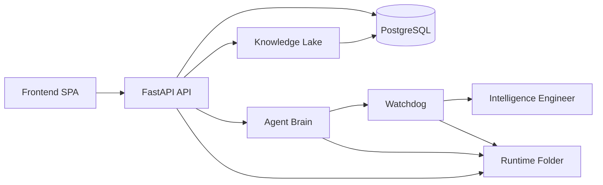

# Founders Technical Documentation

## 1. Purpose

Procurement Flow Specialist BD is a procurement intelligence and tender execution platform built for Bangladesh public procurement workflows. The system combines:

- live tender discovery
- document acquisition and OCR
- BOQ and SOR rate analysis
- PPR 2025 compliance checks
- competitor and win-probability intelligence
- contractor DNA and lifecycle analytics
- watchdog and repair-oriented system diagnostics

The codebase is organized so the database is the source of truth, the API is the integration surface, and the agent layer provides orchestration and explanations.

## 2. High-Level Architecture



### Core layers

- Frontend: the dashboard, tender views, BOQ tools, and executive views.
- API: FastAPI routes for intelligence, tender, PPR, watchdog, engineer, and knowledge graph operations.
- Database: PostgreSQL tables for tenders, awards, lifecycle, contractor DNA, intelligence aggregates, and learning outcomes.
- Agent Brain: inter-agent messaging, knowledge sharing, and agent execution routing.
- Watchdog: error capture, health reporting, and operational logs.
- Intelligence Engineer: system map plus fix recommendations for known failures.

## 3. Canonical Data Model

The important current tables are:

- `procurement_tenders`
- `app_records`
- `live_tender_sources`
- `award_records_v2`
- `procurement_lifecycle`
- `contractors`
- `contractor_dna`
- `knowledge_entries`
- `eexperience_completed`
- `ecms_ongoing`
- `econtract_execution`
- `ppr_evaluations`

### Record roles

- `procurement_tenders`: canonical tender row keyed by package number.
- `app_records`: planned estimate and APP context.
- `live_tender_sources`: live notice payload and tender listing metadata.
- `award_records_v2`: award result and contractor winner record.
- `procurement_lifecycle`: denormalized cross-stage record used for analytics and ML.
- `contractors`: contractor master row.
- `contractor_dna`: contractor behavior profile.

## 4. Contractor DNA

Contractor DNA is a derived profile that combines award history, lifecycle behavior, and execution quality.

### Derived fields

- `total_contracts`
- `total_amount_bdt`
- `avg_award_bdt`
- `agencies_worked`
- `districts_worked`
- `preferred_agency`
- `preferred_zone`
- `avg_npp`
- `npp_volatility`
- `win_rate`
- `avg_discount_pct`
- `completion_rate`
- `on_time_rate`
- `avg_delay_days`
- `total_experience_contracts`
- `total_experience_value_bdt`
- `health_score`

### Source logic

The contractor DNA rebuild process uses:

- `procurement_lifecycle` for award and win history
- `econtract_execution` for execution performance
- `contractors` for persisted canonical contractor rows
- `contractor_dna` for the latest computed profile

### Example DNA response

```json
{
  "contractor": "M/S ABC ENGINEERS",
  "contractor_id": "8a5f...",
  "total_awards": 14,
  "total_value": 584200000.0,
  "preferred_agency": "BWDB",
  "preferred_zone": "Zone-A",
  "win_rate": 0.42,
  "health_score": 0.81,
  "recent_awards": [
    {
      "tender_id": "1298004",
      "agency": "BWDB",
      "contractor_name": "M/S ABC ENGINEERS",
      "amount": 42500000,
      "award_date": "2026-05-12"
    }
  ]
}
```

## 5. Lifecycle Intelligence

The lifecycle layer is the product memory of a tender across stages.

### Lifecycle stages

1. APP
2. Tender
3. Live Notice
4. Opening
5. Award
6. Lifecycle summary row

### Matching order

The repair logic resolves a tender by:

- exact `procurement_tenders.id`
- exact `procurement_tenders.package_no`
- matching `procurement_lifecycle.package_no`
- matching `procurement_lifecycle.tender_id`
- fallback pattern matching for legacy IDs

### Example lifecycle response

```json
{
  "tender_id": "1298004",
  "summary": {
    "stage_count": 5,
    "has_app": true,
    "has_live": true,
    "has_opening": true,
    "has_award": true,
    "has_lifecycle": true
  },
  "stages": [
    { "stage": "lifecycle", "data": { "package_no": "1298004" } },
    { "stage": "tender", "data": { "package_no": "1298004" } },
    { "stage": "app", "data": { "estimated_cost_bdt": 50000000 } },
    { "stage": "live", "data": { "status": "Live" } },
    { "stage": "award", "data": { "contractor_name": "M/S ABC ENGINEERS" } }
  ]
}
```

## 6. Watchdog

The watchdog is the operational error sink and health monitor.

### Responsibilities

- capture runtime exceptions
- persist logs under `runtime/logs`
- summarize agent health
- summarize database health
- record pipeline runs
- hand failures to the Intelligence Engineer for diagnosis

### Important behavior

- Missing agent instances are reported as `down`
- Unavailable registered agents are reported as `degraded`
- Health reports now reflect critical failures instead of silently downgrading them

## 7. Intelligence Engineer

The Intelligence Engineer is the internal system map and fix recommender.

### Responsibilities

- maintain a component map of agents, endpoints, tables, and pipeline phases
- map error messages to likely root causes
- generate specific repair steps
- provide verification commands

### What it knows

- registered agents and agent IDs
- API routes
- database tables
- pipeline phases
- known error patterns
- fix library entries

### Example diagnosis flow

```text
Watchdog captures error
-> Intelligence Engineer identifies component
-> engineer matches pattern
-> engineer returns fix steps
-> operator verifies route / query / table
```

## 8. API Surfaces

### Intelligence

- `GET /api/intel/contractors`
- `GET /api/intel/contractors/{identifier}`
- `GET /api/intel/contractors/{identifier}/benchmark`
- `GET /api/intel/lifecycle`
- `GET /api/intel/lifecycle/stats`
- `GET /api/intel/agency-intel`
- `GET /api/intel/zone-intel`
- `GET /api/intel/award-trends`

### Brain / Knowledge Graph

- `GET /api/knowledge-graph/contractor/{name}`
- `GET /api/knowledge-graph/lifecycle/{tender_id}`
- `GET /api/knowledge-graph/stats`

### Watchdog and engineer

- `GET /api/watchdog/health`
- `GET /api/watchdog/dashboard`
- `GET /api/watchdog/errors`
- `POST /api/watchdog/analyze`
- `GET /api/engineer/status`
- `POST /api/engineer/diagnose`

## 9. Operational Examples

### Contractor DNA

```bash
curl http://localhost:8000/api/knowledge-graph/contractor/Techno%20Drugs%20Ltd.
```

### Tender lifecycle

```bash
curl http://localhost:8000/api/knowledge-graph/lifecycle/1239360
```

### Watchdog health

```bash
curl http://localhost:8000/api/watchdog/health
```

## 10. Runtime Storage

Runtime artifacts should live inside the repository, primarily under:

- `runtime/`
- `runtime/logs/`
- `runtime/archive/`

The repository root should remain source-focused. Generated logs, temporary exports, and scratch outputs should be archived under `runtime/archive/` instead of left beside source files.

## 11. Recommended Development Flow

1. Inspect the real checkout.
2. Patch the concrete route or model gap.
3. Compile the touched Python modules.
4. Smoke test the live endpoint.
5. Update docs only after the behavior is verified.

## 12. Notes for Future Extensions

- Keep contractor DNA rebuilds idempotent.
- Prefer the `procurement_lifecycle` table for cross-stage analytics.
- Prefer PostgreSQL-backed queries over JSON file fallbacks.
- Preserve explanation output from the watchdog and engineer layers.
- Keep runtime artifacts archived inside the repo, not scattered across the root.
